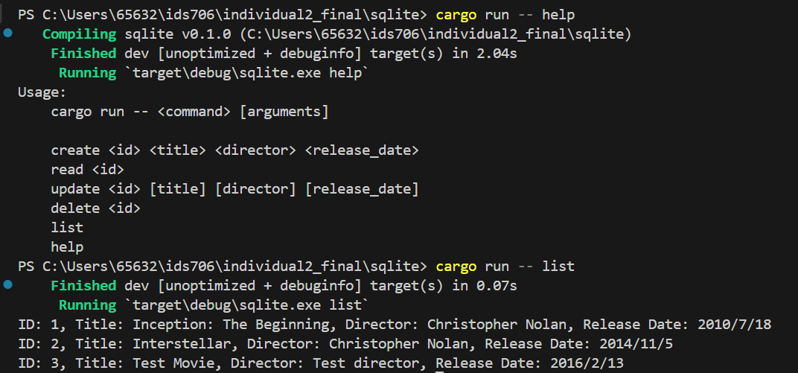

# Rust CLI Tool

SQLite is a command-line interface tool built with Rust, enabling efficient management of a simple movie database. This CLI tool allows for operations such as adding, retrieving, updating, deleting, and listing movie records.

## Table of Contents

- [Features](#features)
- [Installation](#installation)
- [Usage](#usage)
- [CI/CD Pipeline](#cicd-pipeline)
- [Screenshot](#sreenshot)

## Features

This CLI tool supports the following functionalities:
- **Create**: Add new movie records.
- **Read**: Retrieve details of a specific movie.
- **Update**: Modify existing movie records.
- **Delete**: Remove movie records from the system.
- **List**: Display all movie records.

## Dependencies
1. Rust: Version 1.56 or higher.
2. rusqlite: A crate that provides SQLite bindings for Rust.
3. SQLite: The application uses SQLite via the rusqlite crate with the bundled feature, so no external installation is necessary.

## Installation

To get started with Rust-CLI, follow these steps:

1. **Clone the repository**:
   ```bash
   git clone https://github.com/your-username/your-repo.git
   cd your-repo
   ```

2. **Build the project**:
   ```bash
   cargo build --release
   ```

3. **Access the executable**:
   Find the executable in the `target/release/` directory after building the project.

## Usage

Execute commands using the syntax below:

- **Help**:
  ```bash
  sqlite help
  ```
  Displays usage and commands.

- **Creating a Movie**:
  ```bash
  cargo run -- create <id> "<title>" "<director>" "<release_date>"
  ```
  Example:
  ```bash
  cargo run -- create 1 "Inception" "Christopher Nolan" "2010/07/16"
  ```

- **Reading a Movie**:
  ```bash
  cargo run -- read <id>
  ```
  Example:
  ```bash
  cargo run -- read 1
  ```

- **Updating a Movie**:
  ```bash
  cargo run -- update <id> ["<title>"] ["<director>"] ["<release_date>"]
  ```
  Example:
  ```bash
  cargo run -- update 1 "Inception: The Beginning"
  ```

- **Deleting a Movie**:
  ```bash
  cargo run -- delete <id>
  ```
  Example:
  ```bash
  cargo run -- delete 1
  ```

- **Listing All Movies**:
  ```bash
  cargo run -- list
  ```

## CI/CD Pipeline
[](https://github.com/iikikk/Rust-CLI-with-SQLite/actions/workflows/build.yml)
[](https://github.com/iikikk/Rust-CLI-with-SQLite/actions/workflows/lint.yml)
[](https://github.com/iikikk/Rust-CLI-with-SQLite/actions/workflows/test.yml)

Our CI/CD pipeline is set up using GitHub Actions and includes the following steps:

1. **Code Checkout**: Pulls the latest code from the main branch.
2. **Environment Setup**: Installs the latest stable version of Rust.
3. **Linting**: Runs `cargo clippy` to ensure code quality.
4. **Build**: Compiles the project using `cargo build --release`.
5. **Testing**: Executes `cargo test` to run all unit tests.
6. **Artifact Upload**: Uploads the built executable as an artifact in the CI pipeline.

This setup ensures that each push or pull request is automatically built and tested, maintaining high code quality and deployment readiness.

## Development Tools
### Use of GitHub Copilot
During the development of this project, GitHub Copilot was utilized extensively to assist with:
1. Code Generation: Auto-completing code snippets, function implementations, and boilerplate code.
2. YAML Configuration: Generating initial GitHub Actions workflow files (build.yml, test.yml, lint.yml), which were then customized.
3. Efficiency: Speeding up the development process by providing context-aware suggestions.

Example:
While writing the main.rs file, Copilot suggested function signatures and match statements, allowing for quicker development of command parsing logic.

## Use of Large Language Models (LLMs)
LLMs were instrumental in debugging and refining the project, especially in the CI/CD integration phase.
1. Debugging CI Issues: When facing errors in the GitHub Actions workflows, LLMs provided insights into the possible causes and solutions.
2. Optimizing Code: LLMs helped in identifying potential code optimizations and best practices.
3. Learning Resources: Provided explanations and examples that deepened the understanding of Rust and SQLite interactions.

Example:
When encountering a linker error related to sqlite3.lib, an LLM helped identify that enabling the bundled feature in rusqlite would resolve the issue by compiling SQLite from source.
## Upload binary artifact


## Screenshot



